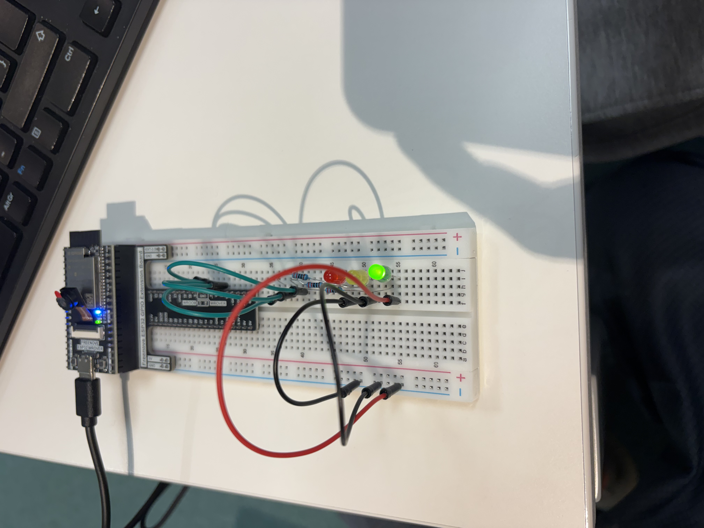
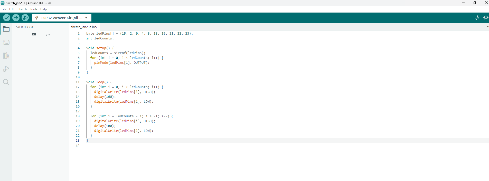
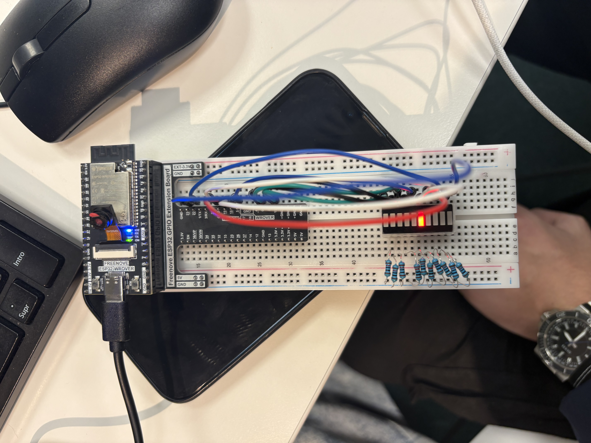
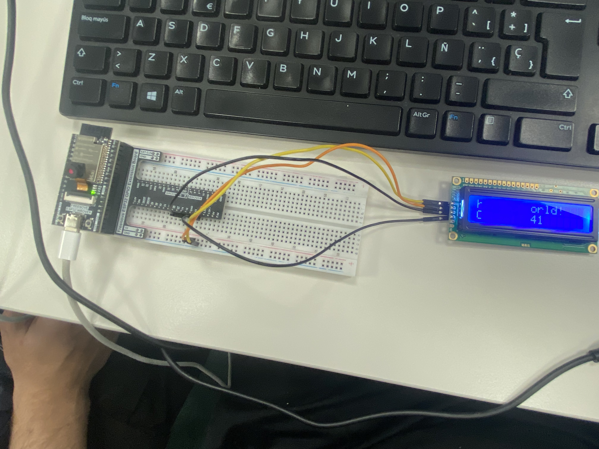
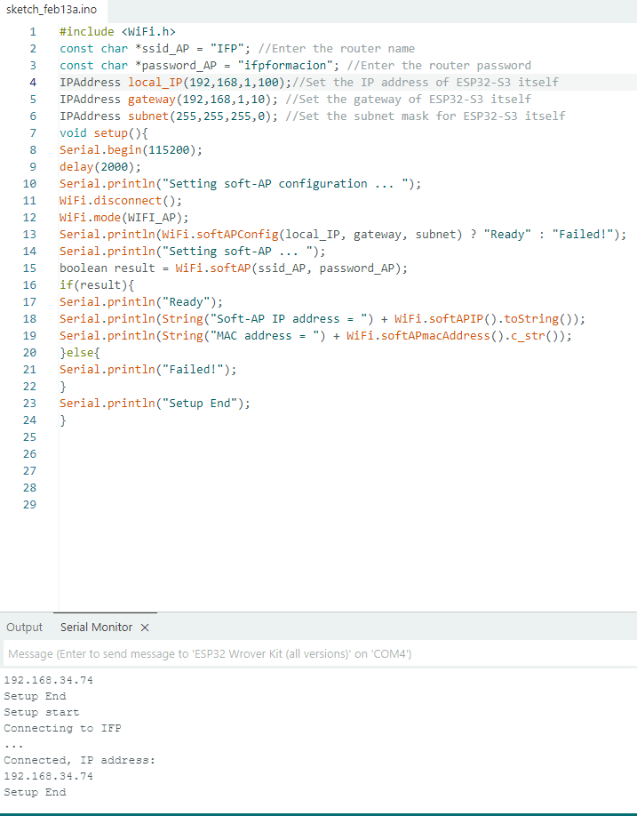

<h1 align="center"> EDUTASK</h1>

  

<em>📚 Plataforma educativa para organizar clases, tareas y calendario académico.</em>

  

  
<h2> Introducción</h2>

  
# Introducción

Nuestro proyecto, llamado Edutask, es una plataforma web educativa hecha para que profesores y estudiantes puedan organizar sus actividades. No es solo un lugar para subir tareas, sino que también tiene herramientas que motivan, como insignias para que te animes y un tutor inteligente. La idea es mejorar la forma en que se enseña y se aprende. Edutask quiere dejar de ser solo una herramienta local para convertirse en una plataforma innovadora que motive a los estudiantes, ayude a los profesores con su trabajo y sea un ejemplo de aprendizaje digital en varios países. Esta plataforma está pensada principalmente para docentes y alumnos de cualquier nivel educativo.

--- 

  
  
<h2> Briefing</h2>

  
Los módulos que más van a ayudar a nuestro proyecto son aplicaciones web para crear la página web de la empresa y cómo configurarla. También el módulo de seguridad informática para que esta página web sea segura y confiable para los usuarios. También la asignatura de servicios en red, ya que con ella podremos ofrecer todos los servicios a los usuarios y a la misma web.
#### **Materiales Necesarios**  
-**Físicos**:
  - Ordenadores con internet
  - Servidor o servicio de hosting para la página web.
  - Teléfonos para probar la plataforma en distintos dispositivos.
  - Periféricos básicos: teclado, mouse, cámara y micrófono.

-**Lógicos (software)**:
  - Sistema operativo (Windows, Linux ).
  - Programas para programar (por ejemplo, Visual Studio Code).
  - Lenguajes: HTML, CSS, JavaScript.
  - Base de datos (MySQL).
  - Git y GitHub para control de versiones y trabajo en equipo.
  - Servicio en la nube o hosting (AWS, Google Cloud, etc.).
  - Certificado SSL para la seguridad de la página.
  - Herramientas de seguridad (firewalls).
  - Plataformas para organizar el proyecto (Trello).

--- 

  
<h2> Arquitectura del software</h2>

  

    
<strong> Base de datos</strong>

    
   

    
Backend

  ## 1. Descripción general del proyecto web
 
  La página web trata sobre una plataforma educativa que se llama Edutask, diseñada para ayudar a profesores y estudiantes a organizar sus actividades académicas de manera más rápida y clara . Su propósito principal es mejorar la enseñanza y el aprendizaje a través de herramientas como insignias motivacionales y un tutor inteligente y también  permitir la gestión de tareas.

  - Crear cuenta y perfil personalizado (para profesores y estudiantes).
  - Subir y gestionar tareas (crear y entregar y puntuar las actividades).
  - Organizar actividades.
  - Sistema de insignias y recompensas para motivar a los estudiantes.
  - Tutor inteligente para guiar y ayudar a los  estudiantes.
  - Interacción entre usuarios (comentarios y mensajes,).
  - Seguridad de la información (autenticación, privacidad de datos).
  - Panel de control para los profesores (seguimiento del progreso, estadísticas de los alumnos).

  ## 2. Identificación de entidades principales

  - **Usuarios**: información de los  profesores y estudiantes (datos personales, credenciales, roles).
  - **Tareas**: detalles de las actividades creadas, entregadas y puntuadas.
  - **Insignias y recompensas:** logros de los  estudiantes.
  - **Mensajes y comentarios**: comunicación entre usuarios.
  - **Progreso y estadísticas**: datos sobre el rendimiento de los estudiantes.
  - **Historial de actividades**: registro actividades hechas en la plataforma.
  - **Datos de seguridad**: información para autenticación y protección .

| Tema de información almacena | ¿Porqué guardarla en la base de datos? |
| ------------- | ------------- |
| Datos de usuarios | Para identificar y diferenciar a profesores y estudiantes  |
| Tareas y actividades  | Para gestionar, almacenar y permitir la entrega y puntuación de tareas|
| Insignias y recompensas  | Para motivar a los estudiantes y llevar registro de sus logros  |
| Mensajes y comentarios  | Para facilitar la comunicación entre usuarios  |
| Progreso y estadísticas  | Para hacer seguimiento de lo que aprenden los  estudiantes  |
| Historial de actividades  | Para seguridad y seguimiento de actividades hechas  |
| Datos de seguridad  | Para proteger la información y controlar el acceso a la plataforma  |

## 3. Datos que se deben guardar de cada entidad (atributos)

#### Usuarios
ID_usuario → INT (autoincremental, clave primaria)

Nombre → VARCHAR(50)
  
Apellidos → VARCHAR(50)
  
Correo_electronico → VARCHAR(100)
  
Contraseña → VARCHAR(255)
  
Rol → ENUM('profesor','estudiante')
Fecha_registro → DATE
  
Foto_perfil → VARCHAR(255)
  
Estado → BOOLEAN

#### Tareas:
  ID_tarea → INT (autoincremental, clave primaria)
  
  Titulo → VARCHAR(100)
  
  Descripcion → TEXT
  
  Fecha_creacion → DATE
  
  Fecha_limite → DATE
  
  ID_profesor → INT (clave foránea)
  
  Estado → ENUM('pendiente','entregada','calificada')
  
  Puntuacion_maxima → INT
  
#### Entrega de tareas:
  ID_entrega → INT (autoincremental, clave primaria)
  
  ID_tarea → INT (clave foránea)
  
  ID_estudiante → INT (clave foránea)
  
  Fecha_entrega → DATE
  
  Archivo_entregado → VARCHAR(255)
  
  Puntuacion_obtenida → INT
  
  Comentarios_profesor → TEXT
  
#### Insignias:
  ID_insignia → INT (autoincremental, clave primaria)
  
  Nombre → VARCHAR(50)
  
  Descripcion → TEXT
  
  Icono → VARCHAR(255)
  
  Fecha_otorgada → DATE
  
  ID_estudiante → INT (clave foránea)
  
#### Mensajes:
  ID_mensaje → INT (autoincremental, clave primaria)
  
  ID_emisor → INT (clave foránea)
  
  ID_receptor → INT (clave foránea)
  
  ID_tarea → INT (clave foránea, puede ser NULL)
  
  Texto → TEXT
  
  Fecha_hora → DATETIME

#### Progreso y estadisticas:
  ID_estadistica → INT (autoincremental, clave primaria)
  
  ID_estudiante → INT (clave foránea)
  
  ID_tarea → INT (clave foránea)
  
  Puntuacion_obtenida → INT
  
  Tiempo_dedicado → INT (en minutos)
  
  Fecha → DATE

#### Historial de actividades:
  ID_historial → INT (autoincremental, clave primaria)

  ID_usuario → INT (clave foránea)

  Accion → VARCHAR(100)

  Fecha_hora → DATETIME

  Detalles → TEXT

#### Datos de seguridad:
  ID_seguridad → INT (autoincremental, clave primaria)
  
  ID_usuario → INT (clave foránea)
  
  Token_sesion → VARCHAR(255)
  
  Fecha_creacion → DATETIME
  
  Fecha_expiracion → DATETIME
  
  IP_acceso → VARCHAR(45)

  ## 4. Relaciones entre las entidades

  #### 1. Usuarios ↔ Tareas
Un profesor (usuario con rol profesor) puede crear muchas tareas.
    
Cada tarea es creada por un solo profesor.
    
Relación: 1 profesor — N tareas
    
  #### 2. Usuarios ↔ Entregas de tareas
Un estudiante puede hacer muchas entregas (una por cada tarea asignada).
    
Cada entrega pertenece a un solo estudiante.
    
Relación: 1 estudiante — N entregas
    
  #### 3. Tareas ↔ Entregas de tareas
Cada tarea puede tener muchas entregas (de diferentes estudiantes).
    
Cada entrega está asociada a una sola tarea.
    
Relación: 1 tarea — N entregas
    
  #### 4. Usuarios ↔ Insignias
Un estudiante puede tener muchas insignias.
    
Cada insignia está asociada a un solo estudiante.
    
Relación: 1 estudiante — N insignias
    
  #### 5. Usuarios ↔ Mensajes
Un usuario puede enviar muchos mensajes.
    
Un usuario puede recibir muchos mensajes.
    
Relación: 1 usuario — N mensajes enviados
    
    Relación: 1 usuario — N mensajes recibidos
    
  #### 6. Tareas ↔ Mensajes
Un mensaje puede estar relacionado con una tarea (por ejemplo, conversación sobre una tarea).
    
No todos los mensajes tienen que estar vinculados a una tarea.
    
Relación: 1 tarea — N mensajes (0 o más mensajes)
    
  #### 7. Usuarios ↔ Progreso y estadísticas
Un estudiante tiene muchas entradas de progreso (por cada tarea o actividad).
    
Cada registro de progreso pertenece a un solo estudiante.
    
Relación: 1 estudiante — N registros de progreso
    
  #### 8. Tareas ↔ Progreso y estadísticas
Cada registro de progreso está asociado a una sola tarea.
    
Una tarea puede tener muchos registros de progreso.
    
Relación: 1 tarea — N registros de progreso
    
  #### 9. Usuarios ↔ Historial de actividades
Un usuario puede tener muchos registros en el historial (acciones que realiza en la plataforma).
    
Relación: 1 usuario — N registros de historial

## 5. Ejemplo de datos (simulación)
#### Entidad: Usuario 
- Nombre: Juan Pérez

- Email: juanp@gmail.com

- Rol: Estudiante

- Fecha de registro: 10/09/2025

#### Entidad: Profesor
- Nombre: María López

- Email: maria.lopez@colegio.edu

- Asignatura: Matemáticas

- Fecha de alta: 05/09/2025

#### Entidad: Curso
- Nombre del curso: Matemáticas 2º Bachillerato

- Profesor asignado: María López

- Fecha de inicio: 15/09/2025

- Fecha de fin: 30/06/2026

#### Entidad: Tarea
- Título: Ejercicios de Álgebra

- Descripción: Resolver los problemas del capítulo 3 del libro.

- Fecha de creación: 20/09/2025

- Fecha de entrega: 25/09/2025

- Estado: Pendiente

#### Entidad: Entrega
- Estudiante: Juan Pérez

- Tarea: Ejercicios de Álgebra

- Fecha de entrega: 24/09/2025

- Archivo: ejercicios_algebra_juanp.pdf

- Calificación: 8/10

#### Entidad: Insignia
- Nombre: “Constancia”

- Descripción: Se da por entregar todas las tareas a tiempo.

- Estudiante: Juan Pérez

- Fecha de obtención: 30/09/2025

## 6. Reflexiones, dificultades y dudas que tienes sobre la base de datos

Nos ha costado más el apartado de Identificación de entidades principales porque aún no tenemos del todo claro cómo será el proyecto y nos ha costado pensar todo esa parte, 
también en el apartado de descripción general del proyecto web por lo que hemos dicho antes no tenemos del todo claro dónde queremos llegar con el proyecto tenemos algunas dudas aun con eso. 

#### ¿Qué no tienes claro sobre la información que hay que guardar?
La verdad que lo tenemos todo bastante claro sobre esto .

Diseño de la base de datos

Este es diseño de la base de datos de EduTask hemos organizado la información de manera clara y funcional. Hemos creado tablas para profesores, usuarios, insignias, clases, tareas y entregas, definiendo sus relaciones para que los datos se conecten bien. 
  
 **ANTES:**
  
  

  

  **DESPUÉS:**
  
   

  

<strong> Arquitectura del sistema</strong>

  
  | Componente del sistema            | Tecnología / Framework                              | Versión          | Puerto                 | Descripción de uso o requisitos                                                                 | Documentación / Info |
|----------------------------------|------------------------------------------------------|------------------|------------------------|-------------------------------------------------------------------------------------------------|-----------------------|
| **Hardware**                      | VPS (4 vCPU, 8GB RAM, 200GB SSD)                    | —                | —                      | Recursos necesarios para alojar backend, base de datos y servidor web de Edutask.               | https://digitalocean.com |
| **Sistema operativo**            | Ubuntu Server (libre)                               | 22.04 LTS        | —                      | SO libre y estable para servidores web. Corre Node.js, Nginx y servicios backend.               | https://ubuntu.com |
| **Interfaz de usuario (Frontend)** | HTML5, CSS3, JavaScript, React.js                    | —                | 3000 (desarrollo)      | Estructura visual del sistema: login, panel, tareas, configuración.                             | https://react.dev |
| **Lógica de negocio (Backend)** | Node.js + Express.js                                 | Node 18 / Exp 4  | 4000                   | Procesa login, usuarios, tareas, cursos; maneja roles y peticiones API.                         | https://expressjs.com |
| **Servidor web**                 | Nginx                                                | 1.24 (Ubuntu)    | 80 / 443               | Publica el frontend y actúa como reverse proxy hacia el backend.                                | https://nginx.org |
| **Base de datos**                | MySQL                                               | 8.0              | 3306                   | Guarda usuarios, roles, cursos, tareas, entregas y calificaciones.                               | https://dev.mysql.com/doc |
| **Sistema gestor de BD**        | phpMyAdmin                                           | 5.x              | 8080 / 80              | Administración visual: creación de tablas, consultas, backups y usuarios.                       | https://phpmyadmin.net |
| **Servicios de APIs**           | API REST                                            | —                | 4000 (backend)         | Comunicación entre frontend y backend: login, registro, tareas, entregas, cursos.               | https://restfulapi.net |

<strong> Objetivos</strong>

Esto son los objetivos de Edutask para crear su página web para que todo funcione correctamente junto a sus plazos aproximados y el estado de la tarea:

| ID  | Prioridad | Objetivo (Requisito)                       | Funcionalidad                                                  | Disparador                                   | Fecha Entrega | Estado    |
|-----|-----------|---------------------------------------------|----------------------------------------------------------------|-----------------------------------------------|---------------|-----------|
| ID0 | Alta     | Registrar usuarios.                         | Sistema de registro y login guardando datos individuales.      | Página "Iniciar sesión" / botón "Crear cuenta" | 20/02/2026    | Pendiente |
| ID1 | Alta      | Permitir el acceso a la página principal.   | Mostrar panel principal con tarjetas de asignaturas.           | Inicio de sesión correcto.                    | 27/02/2026    | Pendiente |
| ID2 | Alta      | Gestión de tareas para estudiantes.         | Lista de tareas con estados (pendiente, entregado).            | Clic en la sección "Tareas".                  | 05/03/2026    | Pendiente |
| ID3 | Alta      | Permitir entrega de tareas online.          | Subida de archivos o texto desde la plataforma.                | Clic en "Entregar tarea".                     | 08/03/2026    | Pendiente |
| ID4 | Media     | Mostrar tareas pendientes con prioridad.    | Pantalla “Pendientes” con tarjetas y barra de progreso.        | Usuario entra en “Pendientes”.                | 12/03/2026    | Pendiente |
| ID5 | Media     | Creación de tareas (solo profesores).       | Formulario con título, fecha límite y descripción.             | Clic en “Crear tarea”.                        | 15/03/2026    | Pendiente |
| ID6 | Baja      | Mostrar calendario académico.               | Calendario con entregas y exámenes.                           | Clic en "Calendario".                         | 20/03/2026    | Pendiente |
| ID7 | Media      | Sistema de insignias motivacionales.        | Insignias automáticas según progreso.                         | Entrega o finalización de tareas.             | 01/04/2026    | Pendiente |
| ID8 | Media     | Asistente / Tutor inteligente.              | Consejos personalizados de hábitos y prioridades.              | Sección “Profesor Inteligente”.               | 10/04/2026    | Pendiente |
| ID9 | Media      | Configuración de usuario.                   | Editar nombre, contraseña, foto y preferencias.                | Clic en "Configuración".                      | 14/04/2026    | Pendiente |

<strong> Arquitectura del sistema</strong>

Esto es el hardware y software que vamos a utilizar para crear y probar nuestro proyecto Edutask. Se compone de varios dispositivos con sus respectivos usos:
  
  | Componente del sistema            | Tecnología / Framework                              | Versión          | Puerto                 | Descripción de uso o requisitos                                                                 | Documentación / Info |
|----------------------------------|------------------------------------------------------|------------------|------------------------|-------------------------------------------------------------------------------------------------|-----------------------|
| **Hardware**                      | VPS (4 vCPU, 8GB RAM, 200GB SSD)                    | —                | —                      | Recursos necesarios para alojar backend, base de datos y servidor web de Edutask.               | https://digitalocean.com |
| **Sistema operativo**            | Ubuntu Server (libre)                               | 22.04 LTS        | —                      | SO libre y estable para servidores web. Corre Node.js, Nginx y servicios backend.               | https://ubuntu.com |
| **Interfaz de usuario (Frontend)** | HTML5, CSS3, JavaScript, React.js                    | —                | 3000 (desarrollo)      | Estructura visual del sistema: login, panel, tareas, configuración.                             | https://react.dev |
| **Lógica de negocio (Backend)** | Node.js + Express.js                                 | Node 18 / Exp 4  | 4000                   | Procesa login, usuarios, tareas, cursos; maneja roles y peticiones API.                         | https://expressjs.com |
| **Servidor web**                 | Nginx                                                | 1.24 (Ubuntu)    | 80 / 443               | Publica el frontend y actúa como reverse proxy hacia el backend.                                | https://nginx.org |
| **Base de datos**                | MySQL                                               | 8.0              | 3306                   | Guarda usuarios, roles, cursos, tareas, entregas y calificaciones.                               | https://dev.mysql.com/doc |
| **Sistema gestor de BD**        | phpMyAdmin                                           | 5.x              | 8080 / 80              | Administración visual: creación de tablas, consultas, backups y usuarios.                       | https://phpmyadmin.net |
| **Servicios de APIs**           | API REST                                            | —                | 4000 (backend)         | Comunicación entre frontend y backend: login, registro, tareas, entregas, cursos.               | https://restfulapi.net |

<strong> Tecnologías implementadas y servicios</strong>

  
### **1. Servidor WEB**
#### **HTML5 Y CSS3**

**HTML5** estructura el contenido.
**CSS3** define estilos, colores y diseño.
Son tecnologías universales, compatibles con todos los navegadores y esenciales para un proyecto web moderno.
#### **PHP**

PHP permite crear páginas dinámicas, conectarse con la base de datos y gestionar el login, usuarios, clases, tareas, etc.
Es ideal para proyectos educativos por su simplicidad y compatibilidad con Apache y MySQL.

#### **Apache**
Es uno de los servidores web más usados del mundo:Lo usamos porque es compatible con PHP, también es bastante estable.
Por estas razones es perfecto para alojar una web como Edutask.

#### **Cloudflare**

Nuestro dominio es “edutask.tallerdekirby.es”, un derivado de “tallerdekirby.es” 
Esta web está gestionada por cloudflare para proporcionar seguridad, rendimiento y configuración avanzada de DNS.

---

### **2. Base de datos**
#### **MySQL**
Es una base de datos perfecta para nuestro proyecto Edutask, ya que nos permite guardar usuarios, clases, tareas, los estados de estas, notas y preferencias.

#### **phpMyAdmin**
Ofrece un panel visual para administrar la base de datos sin tener que usar comandos. Con este programa podremos crear tablas, exportar backup o ver errores de una manera sencilla y visual.

---

### **3. Almacenamiento y Backup**
#### **TrueNAS**
TrueNAS es un sistema operativo especializado para almacenamiento en red. Lo usamos porque dentro de él se pueden gestionar copias de seguridad de una manera intuitiva.

#### **Rsync**
Rsync se usa para automatizar copias de seguridad y sincronizar directorios entre servidores. Las ventajas que ofrece son por ejemplo que es seguro y rápido, copia datos para copias de seguridad incrementales y porque tendremos un backup. Perfecto para evitar perder datos del proyecto.

---

### **4. DNS Interno / Filtrado**
- El DNS es un servicio que permite convertir los nombres de las páginas web, como por ejemplo www.google.com , en direcciones IP para que los dispositivos puedan conectarse a Internet. Nosotros hemos utilizado   Pi-hole como servidor DNS para gestionar estas peticiones dentro de la red.
  
#### **Pi-hole:**
Pi-hole actúa como servidor DNS interno. Otras funciones que nos vienen perfectas para el proyecto es que filtra la publicidad, acelera la navegación, también puede gestionar dominios locales y facilita el acceso a los servidores.

---

### **5. DHCP Server**

- El DHCP es un servicio de red que se encarga de asignar automáticamente direcciones IP y otros parámetros de red a los dispositivos que se conectan a una red. El dchp hace que  los equipos puedan comunicarse sin necesidad de configurar la red de forma manual.

---

### **6. Seguridad y Red**
#### **pfSense**
pfSense es un firewall profesional open-source. Puede proteger los servicios internos, controla el tráfico y aplica reglas de seguridad. Sin pfSense, los servidores quedarían expuestos y sin control.

<strong> Listado de Tareas</strong>

  
### **TareaID0  Registrar usuarios**

- Descripción: Crear el sistema para que los usuarios puedan registrarse e iniciar sesión.
- Cómo se hace: Se hacen formularios de registro y login. El backend guarda los datos en la base de datos y valida que el usuario exista.

 ### **TareaID1 Acceso a la página principal**

- Descripción: Mostrar la página principal con las asignaturas después de iniciar sesión.
- Cómo se hace: El backend revisa las credenciales y envía al usuario al panel principal donde React muestra las asignaturas.

### **Tarea ID2  Gestión de tareas para estudiantes**

- Descripción: Crear una lista donde el estudiante vea sus tareas con su estado.
- Cómo se hace: El frontend pide a la API las tareas y las muestra organizadas por estado (pendiente, entregado).

 ### **Tarea ID3  Entrega de tareas online**

- Descripción: Permitir que el estudiante suba un archivo o escriba un texto para entregar su tarea.
- Cómo se hace: Se crea un formulario con opción de subir archivos y una ruta en la API para guardar la entrega.

### **Tarea ID4  Mostrar tareas pendientes con prioridad**

- Descripción: Hacer una pantalla que muestre las tareas pendientes resaltadas según prioridad.
- Cómo se hace: El frontend ordena las tareas y las muestra con tarjetas, colores o barras para que se vean las más importantes.

### **Tarea ID5  Creación de tareas (profesores)**

- Descripción: Crear un formulario para que los profesores puedan añadir nuevas tareas.
- Cómo se hace: Se diseña un formulario con título, fecha límite y descripción, y el backend guarda la tarea mediante la API.

### **Tarea ID6  Calendario académico**
- Descripción: Mostrar un calendario con las fechas importantes.
- Cómo se hace: Se usa un componente de calendario y se cargan las fechas desde la base de datos usando la API.

### **Tarea ID7  Sistema de insignias motivacionales**

- Descripción: Dar insignias automáticamente cuando los estudiantes cumplen  objetivos.
- Cómo se hace: Se crean reglas simples en el backend que revisan el progreso del estudiante y asignan la insignia correspondiente.

 ### **Tarea ID8  Tutor inteligente**

- Descripción: Dar consejos personalizados según las tareas y el rendimiento del estudiante.
- Cómo se hace: El sistema revisa los datos del usuario (tareas, atrasos, hábitos) y genera recomendaciones.

### **Tarea ID9  Configuración de usuario**

- Descripción: Permitir que el usuario modifique sus datos personales.
- Cómo se hace: Se crea una sección de ajustes con formularios que actualizan la información mediante la API.

### **Tarea ID10  Configurar Cloudflare para el dominio**

- Descripción: Enlazar el dominio edutask.tallerdekirby.es con Cloudflare.
- Cómo se hace: Se añade el dominio a Cloudflare, se cambian los DNS del registrador y se crean los registros A/AAAA apuntando a la IP pública (77.231.11.106).

### **Tarea ID11  Abrir y redirigir tráfico desde la IP pública**

- Descripción: Permitir que el tráfico desde Internet llegue a la red del centro.
- Cómo se hace:Se configuran reglas de firewall para aceptar tráfico entrante desde 77.231.11.106 y dirigirlo hacia el pfSens.

### **Tarea ID12  Configurar pfSense como firewall principal**

- Descripción: pfSense gestionará la red local y el filtrado de tráfico.
- Cómo se hace:Se definen reglas de firewall para cada servidor (WEB, DB, TRUENAS, DNS) y se activan las interfaces.

### **Tarea ID13  Configurar DHCP**

- Descripción: Asignar IPs automáticas dentro del rango 192.168.135.X/24.
- Cómo se hace: En pfSense se habilita DHCP, se define el rango y se reservan IPs fijas para cada servidor.

### **Tarea ID14  Configurar el servidor WEB**

- Descripción: Levantar un servidor Apache/PHP para alojar la web de Edutask.
- Cómo se hace: Se instala Apache, PHP y las dependencias. Se sube el frontend y backend (si corresponde) y se habilita el acceso por HTTP/HTTPS.

### **Tarea ID15  Configurar el servidor DB con MySQL**

- Descripción: Instalar MySQL y phpMyAdmin para gestionar la base de datos.
- Cómo se hace: Se instala MySQL, se crean usuarios, permisos y la base de datos de Edutask. Luego se habilita phpMyAdmin para gestión visual.

### **Tarea ID16 Configurar TRUENAS para copias y almacenamiento**

- Descripción: Usar TRUENAS para sincronización y backups mediante rsync.
- Cómo se hace:Se instala TRUENAS, se crean datasets y se activan tareas rsync para copiar los datos de la web y base de datos.

### **Tarea ID17  Configurar DNS interno con Pi-Hole**

- Descripción: Pi-Hole gestionará DNS local y filtrado básico.
- Cómo se hace: Se instala Pi-Hole, se asigna una IP fija y se configura como servidor DNS para toda la red.

---

  
<h2> Servicios</h2>

  
<strong> DNS y DHCP Pi-hole</strong>

  
## Configuración del servicio DNS con Pi-hole

 Pi-hole funciona como un servidor DNS dentro de nuestra red. Además de traducir los nombres de las páginas web, ofrece funciones muy útiles para nuestro proyecto, como el bloqueo de publicidad, una navegación más rápida, mayor privacidad y un menor consumo de datos. También nos permite gestionar dominios locales y facilita el acceso a los servidores de la red.

El servidor DNS es necesario para poder navegar por Internet de forma normal, ya que se encarga de convertir los nombres de las páginas web en direcciones IP. Sin un DNS, tendríamos que usar directamente las direcciones IP, lo que haría la navegación más complicada. Pi-hole mejora la experiencia de uso al reducir la publicidad, aumentar la privacidad y disminuir el uso de ancho de banda.

La información oficial sobre Pi-hole se puede encontrar en su página web oficial, en la dirección https://pi-hole.net/
, donde se explica su funcionamiento y sus opciones de configuración.

Para instalar el servicio DNS hemos utilizado una máquina virtual con Ubuntu Server 22.04, configurada con la dirección IP fija 192.168.6.100, lo que permite que los dispositivos de la red encuentren siempre el servidor DNS. La máquina virtual tiene 1 GB de memoria RAM, un procesador, 16 GB de disco duro y una configuración de red con IP fija para asegurar el correcto funcionamiento del servicio.

Antes de instalar Pi-hole, hemos actualizado el sistema operativo usando los comandos apt update y apt upgrade para tener el sistema al día. Después, hemos instalado Pi-hole usando el instalador oficial con el comando curl -sSL https://install.pi-hole.net
 | bash. Durante la instalación hemos elegido la tarjeta de red correcta, hemos confirmado la dirección IP del servidor y hemos seleccionado un servidor DNS externo que Pi-hole usa como apoyo. También hemos configurado las opciones básicas del DNS y hemos activado el panel web de administración.

Cuando terminó la instalación, hemos establecido una contraseña para entrar al panel web de Pi-hole con el comando pihole -a -p, lo que nos permitió gestionar el servicio de forma gráfica y sencilla. Por último, hemos configurado la dirección IP 192.168.6.100 como servidor DNS en el router o directamente en los dispositivos de la red, haciendo que todas las consultas DNS pasen por Pi-hole y se aplique el bloqueo de publicidad automáticamente.

La única incidencia que nos apareció durante la configuración fue al usar netplan, ya que los errores en los espacios del archivo provocaban fallos en la red. Este problema lo solucionamos corrigiendo la estructura del archivo y respetando los espacios necesarios, y después de eso el servicio DNS funcionó correctamente.

## Configuración del servicio DCHP con Pi-hole

El servicio DHCP es un servicio de red que se encarga de dar direcciones IP y otros datos de red de forma automática a los dispositivos que se conectan a la red. Gracias al DHCP, los equipos pueden conectarse y comunicarse sin tener que configurar la red a mano.

El servicio DHCP es necesario porque hace más fácil la conexión de los dispositivos a la red, evita errores al poner las direcciones IP manualmente y ayuda a organizar mejor las direcciones IP disponibles.

La información oficial sobre el servicio DHCP y su uso en Pi-hole se puede encontrar en la página web oficial de Pi-hole, en la dirección https://pi-hole.net/
, donde se explica su funcionamiento y cómo configurarlo.

Para configurar el servicio DHCP hemos usado Pi-hole desde su panel web. En la configuración hemos puesto un rango de direcciones IP que va desde la 192.168.6.120 hasta la 192.168.6.130. También hemos configurado la puerta de enlace como 192.168.6.1 y la máscara de red 255.255.255.0 para que los dispositivos funcionen correctamente en la red.

La máquina virtual donde tenemos instalado Pi-hole usa Ubuntu Server 22.04, tiene 1 GB de memoria RAM, un procesador, 16 GB de disco duro y una dirección IP fija, lo que permite que el servicio DHCP funcione sin problemas.

Para realizar la configuración, primero entramos al panel web de Pi-hole desde un navegador. Después activamos el servicio DHCP y configuramos el rango de direcciones IP 192.168.6.120 a 192.168.6.130, la puerta de enlace 192.168.6.1 y la máscara de red 255.255.255.0. Por último, guardamos los cambios para que los dispositivos que se conecten a la red reciban la configuración automáticamente.

Durante la configuración del servicio DHCP no hemos tenido ningún problema, ya que todo funcionó correctamente desde el principio.

  

 

   

  
<strong> Apache/PHP</strong>

Configuración del servidor web Apache 2 y PHP

Apache 2 es un programa que sirve para crear un servidor web, es decir, para poder ver páginas web desde otros dispositivos de la red o desde Internet. PHP es un lenguaje que funciona junto con Apache y sirve para hacer páginas web que cambian según lo que haga el usuario o según la información que tenga el servidor. Gracias a Apache y PHP podemos crear y probar páginas y servicios para nuestro proyecto.

Apache 2 y PHP son necesarios porque nos permiten tener nuestro propio servidor web donde guardar páginas, hacer pruebas y facilitar el acceso a los servicios desde la red. También nos sirve si necesitamos una página para controlar cosas del sistema o enseñar información del proyecto.
 

  

La información oficial sobre Apache y PHP se puede encontrar en sus páginas oficiales, como las de Apache Software Foundation y The PHP Group, donde explican cómo funcionan y cómo instalarlos.

Para la instalación hemos usado un sistema Debian. Primero hemos actualizado el sistema usando los comandos apt update y apt upgrade para tener todo al día. Después hemos instalado Apache 2 con el comando apt install apache2 y comprobamos que funcionaba entrando desde un navegador con la dirección IP del servidor. Cuando vimos la página que aparece por defecto, supimos que estaba bien instalado.

Luego hemos instalado PHP y lo necesario para que funcione con Apache usando el comando apt install php libapache2-mod-php. Después reiniciamos Apache para aplicar los cambios. Para comprobar que PHP funcionaba bien, hicimos un archivo de prueba dentro de la carpeta del servidor web con una página sencilla y entramos desde el navegador para ver que se mostraba correctamente.

Gracias a esta instalación, ahora tenemos un servidor web con Apache 2 y PHP, lo que nos permite crear páginas web que funcionan y servicios para nuestro proyecto.
 

  

Durante la instalación hemos tenido un problema con PHP, porque después de terminar no se abría la página en el navegador y pensábamos que no funcionaba. Al final vimos que el problema no era de la instalación, sino que estábamos escribiendo mal la dirección en el navegador. Cuando pusimos la dirección correcta del servidor con el archivo de prueba, la página se abrió sin problemas y comprobamos que PHP funcionaba bien.

 

  
<strong> Servidor MySql</strong>

 
- MySQL es un servidor de bases de datos que sirve para guardar y organizar información. Los datos se guardan en tablas dentro de la base de datos y luego pueden ser usados por programas o páginas web. Normalmente se usa junto con servidores web y con PHP para crear páginas web dinámicas. Por ejemplo, una página web puede guardar usuarios o información en la base de datos y después mostrarla cuando sea necesario.

- La función del servidor MySQL dentro de la red es guardar y gestionar datos para las aplicaciones o páginas web que lo necesiten. De esta forma se pueden guardar datos de forma ordenada y después consultarlos cuando haga falta. En nuestro proyecto, MySQL dará servicio a las aplicaciones o páginas que necesiten trabajar con datos.

Nosotros hemos instalado el servidor MySQL en una máquina virtual con Ubuntu Server. La máquina tiene: 
- Adaptador puente 
-  Disco de 50 GB
- 2 GB de RAM 
- 2 de CPU

- Para instalar MySQL primero hemos actualizado el sistema usando los comandos **sudo apt update y sudo apt upgrade**. Después hemos instalado el servicio usando el comando **sudo apt install mysql-server**.

- Hemos  creado  un usuario nuevo para poder usar nuestra base de datos. Para hacerlo tenemos que entrar a MySQL y usar el comando **CREATE USER 'edutask'@'localhost' IDENTIFIED BY 'my_password'** para crear el usuario con contraseña. Después puesto  el comando **GRANT ALL PRIVILEGES ON . TO 'edutask'@'localhost' WITH GRANT OPTION** para darle permisos al usuario y que pueda trabajar con las bases de datos. Finalmente se puede salir del programa con el comando **EXIT**.Es necesario crear un nuevo usuario en MySQL porque no es recomendable usar siempre el usuario administrador (root) para trabajar con las bases de datos. El usuario root tiene todos los permisos del sistema y si se usa para todo puede ser un problema de seguridad.

- Por eso se crea un usuario nuevo, en nuestro caso edutask, para que sea el que use la aplicación o la base de datos del proyecto. De esta forma se pueden controlar mejor los permisos y limitar lo que puede hacer cada usuario dentro del servidor.

Gracias a esta configuración podremos usar MySQL en nuestro proyecto para guardar y gestionar datos de forma organizada.

  
<strong>Truenas</strong>

TrueNAS es un sistema operativo que se usa para crear un servidor de almacenamiento en red (NAS). Sirve para guardar archivos en un solo lugar y poder acceder a ellos desde diferentes dispositivos dentro de la misma red.

Entre sus características principales está que permite compartir archivos en la red, gestionar usuarios y permisos y guardar copias de seguridad. Además, tiene una interfaz web que facilita mucho su configuración y administración.

Para instalar TrueNAS hemos creado una máquina virtual en VirtualBox. En la configuración seleccionamos como sistema operativo **BSD de 64 bits**. También configuramos la red en **adaptador puente** para poder acceder a la máquina desde otros equipos de la red. Usamos la ISO **TrueNAS Core** para hacer la instalación.

La máquina virtual la configuramos con **4 GB de RAM y tres discos duros**. Uno de los discos se usa para instalar el sistema operativo y los otros dos se dejan libres para poder crear más adelante un sistema de almacenamiento **RAID1**. Durante la instalación seleccionamos el disco donde se instala el sistema y elegimos el **modo de arranque BIOS**. Cuando termina la instalación reiniciamos la máquina virtual y quitamos la ISO.

Después de reiniciar aparece el menú principal de TrueNAS. A partir de ese momento podemos entrar desde un navegador web usando la dirección de la máquina virtual para configurar el sistema y sus servicios.

En nuestro proyecto utilizamos TrueNAS para guardar y compartir archivos dentro de la red, de forma que los equipos del proyecto puedan acceder a ellos cuando sea necesario.

## Servicios del proyecto

| Servidor | Servicio | Directorio + Archivo de configuración |
|----------|----------|---------------------------------------|
| Ubuntu Server | DNS (Pi-hole) | /etc/pihole/ |
| Ubuntu Server | DHCP (Pi-hole) | /etc/dnsmasq.d/ |
| Debian | Apache2 | /etc/apache2/apache2.conf |
| Debian | PHP | /etc/php/ |
| Ubuntu Server | MySQL | /etc/mysql/mysql.conf.d/mysqld.cnf |
| TrueNAS | Almacenamiento NAS | Configuración desde la interfaz web |

## Copias de seguridad con TrueNAS

Para nuestro proyecto, necesitamos guardar copias de los datos importantes de los servidores:

- **Base de datos MySQL** 

- **Archivos de configuración de Apache**  
  

- **Archivos de configuración de PHP**  
   

- **Configuración de Pi-hole (DNS y DHCP)**  
   

- **Archivos del servidor web**  
  

- **Documentación y archivos del proyecto**  
  

- **Copias de seguridad generales**
  
- **Pfsense**
  

  

  
<strong>IA Tutor Inteligente</strong>

---

  
<h2> Red</h2>

  
  

<strong> Diagrama de la red</strong>

      - Este es nuestro diagrama de red de Edutask, donde se muestra cómo se organiza toda la infraestructura del proyecto. Desde la entrada del dominio a través de Cloudflare hasta la red interna gestionada por pfSense, se distribuyen los diferentes servicios importantes como el servidor web, la base de datos, el sistema de almacenamiento con TrueNAS y el servidor DNS con Pi-hole.
    

  

  - Este es nuestro diagrama de red de Edutask, donde se muestra cómo se organiza toda la infraestructura del proyecto. Desde la entrada del dominio a través de Cloudflare hasta la red interna gestionada por pfSense, se distribuyen los diferentes servicios importantes como el servidor web, la base de datos, el sistema de almacenamiento con TrueNAS y el servidor DNS con Pi-hole.

---

  
<h2> Organización</h2>

  
#### Diagrama de Gantt:
  
  

  

  https://docs.google.com/spreadsheets/d/11hAp5gZndAwbAvoBHB6q7AiIfCZhdHiujqfQJX5VaoE/edit?usp=sharing
  

---

  
<h2> Web</h2>

<strong> Mockup</strong>

    

 
 
La página está organizada de forma clara y ordenada el color principal de la web son colores claros como el blanco y el azul , en nuestra web la tipografia es open sans. Las clases están puestas en cuadros distribuidos en dos filas y dos columnas, todo sea fácil de encontrar.
A la izquierda hay una barra fija con iconos para moverse por la página (inicio, tareas, calendario, etc.). La parte del medio es para lo más importante que son  las clases que es lo que se tiene que ver mas.
Cada asignatura tiene un color diferente (azul, naranja, rojo y verde), lo que ayuda a reconocerlas rápido y hace que la página se vea más clara. El fondo blanco hace que los colores resalten más.
La letra es sencilla y moderna, hace que se vea ordenado. La página tiene botones como “Entrar” y “Crear Clase” que son fáciles de ver y usar. También hay iconos en la barra lateral que ayudan a saber para qué sirve cada sección sin tener que leer mucho. Cada clase tiene una estrellita para marcarla como favorita, lo que añade una función extra sin complicar el diseño.

  
  [Mockup](https://www.canva.com/design/DAG1F7t7cgo/vUko967jFhBP_onj2v1dsA/edit?utm_content=DAG1F7t7cgo&utm_campaign=designshare&utm_medium=link2&utm_source=sharebutton)
  

  

  - Esta es la pantalla de inicio de nuestra web. En la parte superior se encuentra nuestro logotipo, y justo debajo aparece nuestro eslogan  con tipografía Open Sans y color de letra gris.
Debajo del eslogan hay un recuadro para iniciar sesión, donde el usuario debe introducir su correo electrónico y contraseña. También se incluye una opción para recuperar la contraseña, cuya pantalla explicaremos a continuación.
Finalmente, debajo de todo, hay una opción para seleccionar el rol de estudiante o profesor, que el usuario deberá marcar antes de continuar.

  

  -En esta pantalla, es para aquellos usuarios que quieran acceder a nuestra web y no se acuerden de su contraseña. En esta página la podrán recuperar. En la parte de arriba podemos ver que aparece el logo en grande y, como antes, debajo nuestro eslogan de color gris. Luego hay un recuadro que pone “Recuperar contraseña” en azul con tipografía Open Sans. Debajo de eso te pide que pongas tu correo electrónico para que luego haya un botón que pone “Enviar código”, que también está en color azul pero más claro. Esto hace que te llegue un código al correo que has puesto. Después hay un texto que te dice que introduzcas el código que te han enviado, y está en color gris con la tipografía Open Sans. Después de este paso, dice que pongas tu nueva contraseña y luego que la vuelvas a introducir para ya poder iniciar sesión con el botón de la parte de abajo, que está en color azul y la letra de dentro en color blanco para que resalte.

 

  
 
  - Esta es la página principal que ve el usuario después de iniciar sesión. En el centro aparecen las clases organizadas en cuadrados, cada una con un color diferente para reconocerlas rápidamente. Las tarjetas muestran el nombre de la asignatura, el curso y un botón   para acceder. También incluyen una estrella para marcar clases como favoritas. A la izquierda aparece una barra lateral fija con los apartados más importantes: inicio, tareas, calendario, insignias y configuración. Esta barra permite moverse por la web de forma fácil y directa.

 

  
 
- En esta página se muestran todas las tareas que el estudiante tiene en las distintas clases. La parte superior tiene un buscador y botones de filtro (todas, pendientes, entregadas…), y hace mas facil encontrar una actividad concreta.
 Las tareas aparecen en forma de lista, con columnas que indican el nombre de la tarea, la asignatura, la fecha límite y el estado (pendiente, entregado o retrasado). Esto ayuda a organizarse mejor y ver rápidamente qué tareas son más urgentes. Como tambien se puede ver hay un boton para crear tareas por si lo necesitas..

  

    
<strong> Mapa de navegabilidad</strong>

El mapa de navegabilidad muestra cómo se organiza la estructura de la página web Edutask y los caminos que puede seguir el usuario dentro de ella. Desde la pantalla inicial de inicio de sesión, el usuario puede acceder a las distintas secciones según su rol (profesor o estudiante).

En el centro del mapa se encuentra la página principal, donde se muestran las clases, y desde ahí se puede acceder fácilmente al resto de apartados: Tareas, Calendario, Insignias, Profesor Inteligente y Configuración.
Cada flecha del mapa indica las conexiones entre pantallas y cómo se pasa de una función a otra, lo que ayuda a entender el recorrido completo dentro de la web.

Gracias a esta estructura, la navegación resulta clara, intuitiva y fluida. Tanto profesores como estudiantes pueden orientarse sin dificultad, accediendo de forma rápida a sus clases, actividades y herramientas principales.

[Mapa de navegación](https://www.figma.com/design/bCnEgSv1KONrkjPDBV6TZc/Mapa-navegaci%C3%B3n-Edutask?node-id=0-1&t=nvBzSE5BChtoyJh0-1)

---

  
  
<h2> Conclusiones</h2>

---

  
  
<h2> Bibliografía</h2>

---

  
<h2> Plan de contingencia</h2>

---

  
<h2> Arduino</h2>

  

  
<h2>Proyecto</h2>

   

  
<h2>Briefing</h2>

    
  **Winston To-Go**: Dispensador Automático con Arduino 🚬

**Winston To-Go** es un sistema de dispensación automatizada diseñado bajo un concepto de "conveniencia urbana". Este proyecto combina una estética de marca clásica con hardware interactivo para crear un prototipo funcional.

---

## 1. Presentación de la Idea
El dispositivo cuenta con un sistema de doble activación para la entrega del producto:
* **Modo Comercial:** Activado mediante una moneda a través de un sensor óptico de herradura.
* **Modo Propietario (Cortesía):** Activado mediante un sensor infrarrojo (IR) de proximidad para una entrega sin contacto y gratuita.
El mecanismo principal utiliza un micro servomotor para desplazar una unidad de producto a través de la ranura de salida.

## 2. Objetivos del Proyecto
* **Objetivo Principal:** Construir un prototipo de dispensador funcional capaz de distinguir entre el ingreso de una moneda y una activación por proximidad, entregando el producto en menos de 3 segundos.
* **Desarrollo de Habilidades:**
    * **Programación en C++:** Gestión de lógica condicional para múltiples entradas de sensores.
    * **Mecatrónica:** Sincronización de un servomotor con señales digitales y analógicas.
    * **Branding:** Aplicación de una identidad visual (Winston To-Go) a un objeto físico funcional.

## 3. Requisitos Técnicos

### Hardware
* **Microcontrolador:** Arduino UNO (R3 o compatible).
* **Actuador:** Micro servomotor SG90 (9g).
* **Sensores:**
    * Sensor óptico de herradura (para detección de monedas).
    * Sensor infrarrojo de proximidad FC-51.
* **Alimentación:** Batería de 9V (con adaptador Jack) o cable USB de 5V.
* **Conectividad:** Cables Jumper (M-M / M-H) y protoboard de 400 puntos.

### Software
* **Entorno:** Arduino IDE (v2.0 o superior).
* **Librerías:** `<Servo.h>` (Librería estándar de Arduino).

## 4. Metodología de Trabajo
1. **Fase de Diseño:** Dibujo de planos y cálculo de dimensiones para la ranura de salida.
2. **Montaje del Circuito:** Conexión de sensores y servomotor en la protoboard.
3. **Programación Inicial:** Carga del código base y calibración de los ángulos del servo.
4. **Construcción del Chasis:** Corte y ensamblaje de la estructura externa y el depósito.
5. **Integración Mecánica:** Montaje del motor y ajuste del brazo empujador.
6. **Pruebas de Campo:** Testeo de detección de monedas y sensibilidad del sensor IR.
7. **Branding Final:** Aplicación de los acabados visuales de **Winston To-Go**.

## 5. Desafíos y Soluciones
* **Desafío:** Atascos en la ranura de salida por fricción.
    * *Solución:* Diseño del canal con inclinación y forrado interior con cinta de baja fricción.
* **Desafío:** Falsos positivos en el sensor de monedas por luz ambiental.
    * *Solución:* Encapsular el sensor en un canal oscuro para aislarlo de la luz externa.
* **Desafío:** Alimentación insuficiente para el servo.
    * *Solución:* Añadir un condensador de 100µF entre VCC y GND o usar una fuente de 5V dedicada al motor.
  

  
  

  
<h2>Listado de tareas</h2>

  
### Fase 1: Diseño y Planificación
**Esquema de Conexiones:** Definir los pines de la placa para el botón y el servo.
**Unai:** Preparación del esquema eléctrico.
***Lyan:** Organización y etiquetado de cables jumpers.

### Fase 2: Hardware y Programación
***Montaje del Circuito:** Conectar el botón y el servomotor a la placa Arduino.
***Unai:Conexión del servomotor y alimentación de la placa.
***Lyan:** Conexión del pulsador (configuración `INPUT_PULLUP`).
**Código y Calibración:** Programar el movimiento del servo al presionar el botón.
***Unai:** Programación de la lógica "si botón pulsado, mover servo".
***Lyan:** Calibración de los ángulos de giro (inicio, empuje y retorno).

### Fase 3: Construcción Física (En proceso 🛠️)
**Corte y Estructura:** Cortar el material (cartón/madera) y armar la caja.
***Unai:** Corte de las piezas del chasis exterior.
***Lyan:** Montaje de la rampa interna y el canal de salida.
**Mecanismo de Empuje:** Unir el servo al brazo empujador dentro de la estructura.
***Unai:** Instalación y fijación del servomotor.
***Lyan:** Ajuste del brazo mecánico para asegurar que solo salga una unidad.

### Fase 4: Branding y Acabados
**Identidad Visual:** Aplicar la estética de "Winston To-Go".
***Unai:** Diseño e impresión de las etiquetas y logotipos.
***Lyan:** Aplicación de vinilos y pintura/acabado exterior del dispensador.
**Test Final de Calidad:** Pruebas de funcionamiento real.
***Unai: Pruebas de resistencia del mecanismo (10 usos seguidos).
***Lyan: Verificación de posibles atascos y ajustes finales.

<h2>Esquema eléctrico y materiales utilizados</h2>

- En esta imagen podemos ver el esquema de conexiones del sistema electrónico del dispensador automático con Arduino. Se muestra cómo el Arduino UNO se conecta a los distintos componentes mediante una protoboard y cables jumper.

- En la parte inferior aparecen los sensores utilizados en el proyecto: un sensor óptico de herradura, que detecta el paso de la moneda, y un sensor infrarrojo FC-51, que detecta la presencia de un objeto en la salida. A la derecha se encuentra el servomotor SG90, encargado de mover el mecanismo del dispensador cuando Arduino recibe la señal de los sensores.

- En conjunto, el diagrama muestra la distribución de la alimentación, las señales y el control del sistema necesario para el funcionamiento del dispensador automático.

 

  
 
  
## Materiales utilizados
* **Microcontrolador:** Arduino UNO (R3 o compatible).
* **Actuador:** Micro servomotor SG90 (9g).
* **Sensores:**
    * Sensor óptico de herradura (para detección de monedas).
    * Sensor infrarrojo de proximidad FC-51.
* **Alimentación:** Batería de 9V (con adaptador Jack) o cable USB de 5V.
* **Conectividad:** Cables Jumper (M-M / M-H) y protoboard de 400 puntos.
  

  

  
<h2>Arduino clase</h2>

  

  **2.1 ¿Qué es Arduino?**
- Arduino es una placa electrónica con un microcontrolador que se puede programar para controlar luces motores sensores y otros dispositivos se utiliza junto con un programa en la computadora para escribir instrucciones y automatizar tareas siendo útil para aprender electrónica y crear proyectos interactivos

**2.2 ¿Cuáles son sus características más importantes?**
- Las características más importantes de Arduino son: tiene un microcontrolador programable. Permite leer sensores y controlar luces y motores. Es fácil de programar y usa un lenguaje sencillo basado en C. Tiene hardware abierto. Se puede elegir entre varios modelos como Uno, Nano o Mega. 

**2.3 ¿Cuál es el origen de Arduino?**
- Arduino fue creado en 2005 en el Instituto IVREA, en Italia, como una herramienta para estudiantes de diseño sin conocimientos técnicos en electrónica y programación. Sus fundadores son: Massimo Banzi, David Cuartielles, Tom Igoe, Gianluca Martino y David Mellis desarrollaron Arduino como una plataforma de hardware libre y de bajo costo, con el objetivo de facilitar la creación de proyectos interactivos.
El nombre "Arduino" proviene de un bar en Ivrea frecuentado por los fundadores, que también toma el nombre de un rey italiano.

**2.4 ¿Qué modelos de Arduino hay? Haz una tabla donde especifiques para cada modelo: microcontrolador, voltaje, pines digitales, entradas analógicas, memoria, reloj.**
| Modelo               | Microcontrolador             | Voltaje | Pines digitales | Entradas analógicas | Memoria Flash | Frecuencia |
|----------------------|------------------------------|---------|------------------|-----------------------|---------------|------------|
| Arduino Uno R3       | ATmega328P                   | 5V      | 14               | 6                     | 32 KB         | 16 MHz     |
| Arduino Mega 2560    | ATmega2560                   | 5V      | 54               | 16                    | 256 KB        | 16 MHz     |
| Arduino Nano         | ATmega328P                   | 5V      | 22               | 8                     | 32 KB         | 16 MHz     |
| Arduino Leonardo     | ATmega32u4                   | 5V      | 20               | 12                    | 32 KB         | 16 MHz     |
| Arduino Due          | AT91SAM3X8E (ARM Cortex-M3)  | 3.3V    | 54               | 12                    | 512 KB        | 84 MHz     |
| Arduino Micro        | ATmega32u4                   | 5V      | 20               | 12                    | 32 KB         | 16 MHz     |
| Arduino MKR1000      | SAMD21 Cortex-M0+            | 3.3V    | 8                | 7                     | 256 KB        | 48 MHz     |
| Arduino Nano 33 IoT  | SAMD21 Cortex-M0+            | 3.3V    | 14               | 8                     | 256 KB        | 48 MHz     |

**2.5 ¿Para qué sirve un Arduino?**

- La principal utilidad que se le da a un arduino es la automatización que esto sirve para controlar las luces por ejemplo de una casa, sensores, motores etc.. que esto puede hacer que podamos abrir una puerta de un parking de un garaje con un mando pero también se les puede dar otras funciones como para el aprendizaje básico de de la programación o en un nivel mas avanzado tambien lo podriamos utilizar en el área de IoT que lo que podemos hacer con esto es recoger los datos de los sensores de los arduino y mandarlos a la nube.
En resumen esta tecnología cada vez está creciendo más gracias a la integración que está teniendo en diferentes ámbitos ya que si nos paramos a pensar estamos rodeados de esta tecnología.

  

**2.6 ¿Qué lenguaje utiliza?**

- Arduino usa un lenguaje C/C++, pero adaptado para que sea más fácil de entender y usar ya que esto muchas veces se utiliza para el aprendizaje o para gente que está empezando a programar. Se usa principalmente en el entorno llamado Arduino IDE, donde escribes y juntas la información envías el código a la placa.
Este lenguaje solo permite controlar un par de objetos básicos como: Luces Leds,Rgb, Motores servos o DC,Sensores de temperatura,humedad o ultrasonido, Pantallas Lcd o Oled y por ultimo para comunicaciones como Bluetooth, Wi-fi etc….

**2.7 ¿Qué es el Arduino IDE?**

- Es el programa que usas en el ordenador para escribir, compilar y cargar código en una placa Arduino y este software es totalmente gratuito.

  

  
  
<h2> ACTIVIDADES</h2>

  
**A1 Blink y Semáforo**

**Blink**

**(1) Objetivo de la práctica**

En una placa de arduino ESP32 tenemos que conseguir que un led parpadee constantemente .

**(2) Material y explicacion de cada componente**
- Un led
- Dos Jumpers
- Una Resistencia
  
**(3) Esquema del circuito como se muestra mas abajo**
  

  

**(4) How To + Codigo explicado: uso de las variables, funciones y demas componentes del codigo**
  

  

**(5) Video de la practica**

[Ver video](IMG_9943.MOV)

**(6) Imagen para la entrada del blog o proyecto**
  

  

**¿Qué son el void setup() and void loop()?**
- void setup(): Se ejecuta una sola vez cuando tu Arduino se ENCIENDE o se reinicia. Se usa para configurar las salidas y las entradas, inicializar variables o iniciar comunicación como por ejemplo el serial o los sensores.

- void loop(): Este bloque se ejecuta repetidamente y sin fin mientras Arduino tenga energía. En loop() pones el código que quieres que repita continuamente, como parpadear un LED o leer sensores.

**¿Qué quiere decir la línea: #define LED_BUITIN 2 ?**
- La línea significa que se crea una constante llamada LED_BUILTIN y que cada vez que aparezca ese nombre en el código, el compilador lo reemplazará por el número 2 antes de compilar. Sirve para indicar que el LED integrado de la placa está conectado al pin 2, a si que en vez de escribir el número directamente en el programa, se usa un nombre más claro y fácil de entender.

**¿Qué quiere decir la línea delay(1000); ?**

- Delay(1000):significa que el programa se detiene durante 1000 milisegundos que es lo mismo que  1 segundo, antes de continuar con la siguiente instrucción.

**Semáforo**

**(1) Objetivo de la práctica**
- En una placa de arduino ESP32 tenemos que conseguir tres leds de color verde,amarillo,rojo se encinedan a timepos diferentes recrando un semaforo.

**(2) Material y explicación de cada componente**
- 3 Jumpers
- 3 Resistencias
- 3 Leds

**(3) Esquema del circuito como se muestra mas abajo**

  

  

(4) How To + Codigo explicado: uso de las variables, funciones y demas componentes del codigo
 

  

   
(5) Video de la practica

[Ver video](IMG_9944.MOV)

(6) Imagen para la entrada del blog o proyecto
 

  

 
<h2> A2-led+button </h2>

  

**Capítulo 2.1 – Button & Led**

(1) Objetivo de la practica
- El objetivo de esta practica es encender una led utilizando un boton. Usando un recorrido electrico.

(2) Material y explicacion de cada componente
- Hemos utilizado 4 Jumpers para pasar la electricidad, 3 resistencias para conducir la electricidad, el boton para encender la led y el led.

(3) Esquema del circuito como se muestra mas abajo

 

  

(4) How To + Codigo explicado: uso de las variables, funciones y demas componentes del codigo
 

  

(5) Video de la practica

https://github.com/user-attachments/assets/5429a2b3-8774-4eb5-addf-49af5b4a905e

**Capítulo 2.2 – Mini table Lamp**

(1) Objetivo de la practica
- El objetivo de esta practica es que con un boton al darle una vez se encienda el led y despues cuando le vuelvas a dar se apague la led asi utilazandolo como si fuera una lampara.
  

(2) Material y explicacion de cada componente
-  Hemos utilizado 4 Jumpers para pasar la electricidad, 3 resistencias para conducir la electricidad, el boton para encender la led y el led.
   
(3) Esquema del circuito como se muestra mas abajo
 

  

(4) How To + Codigo explicado: uso de las variables, funciones y demas componentes del codigo

 

  

(5) Video de la practica

  

https://github.com/user-attachments/assets/d80640d9-dd3e-445e-92de-0cb5115ea3db

 
<h2> A3-RGB </h2>

(1) Objetivo de la practica
Aprender a controlar un LED RGB usando el Arduino (ESP32 | Wrover), manipulando sus funciones de color y comprendiendo conceptos como luz multicolor, aleatoriedad, gradientes y control de intensidad de cada color primario (rojo, verde y azul).

(2) Material y explicacion de cada componente

LED RGB de 4 pines (ánodo común) Función: Es el dispositivo que emite luz de colores.
Tiene 3 LEDs internos (Rojo, Verde, Azul) y un pin común (positivo en este caso).

Combinando la intensidad de cada color, se pueden generar millones de colores visibles.

Resistencias 220 Ω Función: Protegen cada LED interno de recibir demasiada corriente, evitando que se quemen.

Cables de conexión (jumper wires) Función: Transportan la señal eléctrica desde los pines de la placa Arduino hacia el LED y las resistencias en la protoboard.

(3) Esquema del circuito como se muestra mas abajo

(4) How To + Codigo explicado: uso de las variables, funciones y demas componentes del codigo

  
  
(5) Video de la practica

https://github.com/user-attachments/assets/b346ac8d-bbca-4d08-afb0-dd93cc8cea40

 

 
<h2>A4-LED Bar </h2>

  
**(1) Objetivo de la práctica**

- Poner en funcionamiento una barra de LEDs y experimentando con efectos de iluminación como el movimiento tipo “Kitt”, de izquierda a derecha con rebote en bucle

**(2) Material y explicacion de cada componente**

- Placa Arduino (ESP32 / Wrover)

- Barra de LEDs (10 LEDs integrados)

- Resistencias de 220 Ω (una por cada LED de la barra)

- Protoboard

- Cables de conexión (jumpers)

**(3) Esquema del circuito como se muestra mas abajo**

  
  

**(4) How To + Codigo explicado: uso de las variables, funciones y demas componentes del codigo**

  

- El programa permite controlar una barra de LEDs conectada a un Arduino, creando un efecto de movimiento tipo KITT, donde los LEDs se encienden de izquierda a derecha y luego regresan en sentido contrario.

**(5) Video de la practica**

https://github.com/user-attachments/assets/0f8fb3c2-b889-41dd-b76c-c303a116f00d

**(6) Imagen para la entrada del blog o proyecto**

  
  

 

 
<h2>A5 - Serial IO </h2>

## **5.1) Comunicación Serial**

**¿Qué aparece en el Serial Monitor?**
- Aparecen mensajes de texto enviados por la placa ESP32. Muestran información del programa mientras se está ejecutando.

 **Pulsa BOOT + EN, ¿qué ocurre? Pulsa solo EN, ¿para qué sirve?**
 -  BOOT + EN: la placa entra en modo programación para subir el código.
 -  Solo EN: la placa se reinicia y el programa empieza de nuevo.
    Sirve para reiniciar la placa o cargar un nuevo programa.

**¿Qué indica Serial.begin(115200);?**
-  Inicia la comunicación serial a una velocidad de 115200 baudios entre el ESP32 y el ordenador.

**¿Qué significa "%.1f s\n"?**
 - Muestra un número con un decimal, la letra s (segundos) y un salto de línea.

## **5.2) Panel LCD1602**

**(1) Objetivo de la practica**
- Aprender a conectar y usar una pantalla LCD1602 con I2C para mostrar mensajes desde el ESP32 utilizando pocos pines.

**(2) Material y explicacion de cada componente**
- ESP32 (Arduino): controla la pantalla y envía los datos.
- Pantalla LCD1602 con I2C: muestra texto en 2 filas de 16 caracteres.
- Módulo I2C (PCF8574): reduce el número de pines necesarios para la pantalla.
- Jumpers hembra-macho (4): sirven para hacer las conexiones.

**(3) Esquema del circuito como se muestra mas abajo**

  

**(4) How To + Codigo explicado: uso de las variables, funciones y demas componentes del codigo**

  

**(5) Video de la practica**

https://github.com/user-attachments/assets/08e0cc64-127b-49f9-9a1b-22a12e503568

**(6) Imagen para la entrada del blog o proyecto**

  

**¿Para qué sirve cada conexión?**
- SCL: controla el ritmo de la comunicación I2C.
- SDA: envía los datos a la pantalla.
- VCC: alimenta la pantalla.
- GND: tierra del circuito.

**¿Qué hace lcd.print() y lcd.clear()?**
- lcd.print(): escribe texto en la pantalla.
- lcd.clear(): borra toda la pantalla.

**¿Cómo mover el texto?**
- lcd.scrollDisplayLeft(): mueve el texto a la izquierda.
- lcd.scrollDisplayRight(): mueve el texto a la derecha.

  

 

 
<h2>A6-Wifi </h2>

 
**(1) Objetivo de la practica**
Aprender a utilizar la conectividad WiFi del ESP32-S3 WROOM.
Comprender los tres modos de funcionamiento WiFi de Station Mode,Access Point (AP) Mode, AP + Station Mode, Crear y alojar una página web en el ESP32. Entender el uso de librerías como WiFi.h y WebServer.h.Comprobar la conectividad entre dispositivos mediante IP.

**(2) Material y explicacion de cada componente**
 1. ESP32-S3 WROOM
Microcontrolador con conectividad WiFi y Bluetooth integrada. Permite actuar como cliente WiFi o como punto de acceso.
2. Cable USB
Permite alimentar el ESP32 y cargar el programa desde el ordenador.
 3. Ordenador
Para programar mediante el Arduino IDE y visualizar el Monitor Serie.
 4. Router WiFi
Proporciona acceso a red e Internet en modo Station.
 5. Navegador Web
Para acceder a la página alojada en el ESP32 mediante su IP.

**How To + Codigo explicado: uso de las variables, funciones y demas componentes del codigo**

  
  
  

  

    
**¿A qué red te has podido conectar? ¿Es 5G, 2.4G? Explica.**
-  A una red 2.4 GHz, porque el ESP32 solo funciona en esa frecuencia.

**¿Son necesarias las tres librerías?**
-  No. Solo hace falta WiFi.h.

**¿Cuándo usar WiFiClient.h y WiFiClientSecure.h?**

- WiFiClient.h: para conexiones TCP normales (HTTP, MQTT).
- WiFiClientSecure.h: para conexiones seguras (HTTPS).

**¿Es posible seleccionar el canal WiFi?**
-  En modo estación no, porque lo decide el router. Solo en modo AP.

**Prueba la conectividad con la IP del ESP32.**
-  Sí, accediendo a la IP desde el navegador o haciendo ping desde el PC o móvil con Arduino.

**¿Uso de softAPConfig?**
-  Configurar IP, gateway y máscara del ESP32 como punto de acceso.

**¿Cómo saber cuántos dispositivos hay conectados?**
-  WiFi.softAPgetStationNum();

**¿Método para ver la IP del AP?**
-  WiFi.softAPIP();

**¿Para qué sirve c_str()?**
 - Para convertir un String a texto tipo C (char*).

**Compila y testea la conexión.**
 - El ESP32 se conecta al router y también crea su propia red al mismo tiempo.

**Código para acceder a la web.**

#include <WebServer.h>
WebServer server(80);

server.on("/", handle_OnConnect);
server.onNotFound(handle_NotFound);
server.begin();

void loop(){
 server.handleClient();
}

**Explica los parámetros.**

200 / 404: código de respuesta (bien / error).

text/html / text/plain: tipo de contenido.

Mensaje: lo que recibe el navegador.

Código del servidor y cambiar puerto.

WebServer server(8080);

server.on("/", handle_OnConnect);
server.onNotFound(handle_NotFound);
server.begin();

  

  

  

